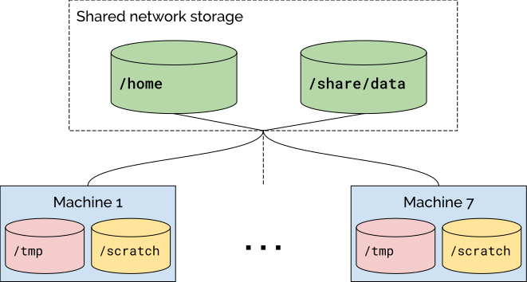

# SOAL Cluster On-boarding

## Quick start

The SOAL cluster is comprised of four high-memory, high-compute machines. Each machine has independent processors and memory, but shared storage. In other words, files that you have saved in your home directory from one machine will show up when you login on other machines, but processes/programs that you run will only be running on that specific machine. Each machine can be accessed via `ssh` and `https` (see below).

All machines are shared across several research groups. Before using the cluster, please make sure you:

- Read and understand all the contents of this document.
- Join the #cluster channel on Slack (stanfordsoal.slack.com).
- Email Tim Keely (tim.keely@stanford.edu) for an account on the cluster.
- Understand basic aspects of Linux usage in a shared computing environment. The SOAL cluster has many users, and using it without requisite knowledge can cause issues for other users.

The cluster is intended for SOAL-related research. Although you may also use the cluster for coursework, priority is given to research projects. Please do not use the cluster for non-Stanford-related projects (e.g., no cryptomining!). When in doubt or confused, feel free to ask questions (e.g., in `#cluster`). We are generally friendly people and try to be helpful!

### VPN connection

To access the cluster you generally need to first connect to Stanford’s VPN. See [https://uit.stanford.edu/service/vpn](https://uit.stanford.edu/service/vpn) for further instructions on installing and using Stanford’s VPN client.

### SSH access

To SSH into the cluster, you must have an SSH client on your personal machine. Some options are the built-in shell on Linux and MacOS machines, or the [WSL](https://docs.microsoft.com/en-us/windows/wsl/faq) command line on Windows. Another option is [Putty](https://www.chiark.greenend.org.uk/~sgtatham/putty/).

For `ssh` access, you must be on Stanford’s VPN, even if you are connecting from within a Stanford network.

Once connected to Stanford’s VPN, connecting to the cluster is as simple as running

    ssh username@soal-?.stanford.edu

from a terminal where `username` is your login username (your usual SUNet creds), and `?` should be replaced with a number between 8 and 11 (inclusive). (See [specs](#specs) below for more info on what machines are available.)

Alternatively, you can connect to `soal-cluster.stanford.edu` to hit a load balancer and be redirected to the least utilized node. But beware that you need to remember which node you are on if you want to return to your processes later. Before doing anything on the command line, make sure you read through this whole document. There are important limitations and gotchas to be aware of!

If you are not familiar with using a Linux terminal, there are many [online tutorials](https://www.techspot.com/guides/835-linux-command-line-basics/) that you might want to check out.

### Rstudio / JupyterLab

You can also use Rstudio and JupyterLab on the clusters through a web interface. Both are excellent tools for interactive data analysis.

While connected to Stanford’s campus network — or connected to Stanford’s VPN if off campus — simply direct your browser to `https://soal-?.stanford.edu`, where `?` is a number between 8 and 11 (inclusive). You’ll see links to access Rstudio and JupyterLab on that page. Alternatively, you can connect to [https://soal-cluster.stanford.edu](https://soal-cluster.stanford.edu) to hit a load balancer, which will redirect to the least utilized node.

# Detailed description

The clusters are composed of 4 independent machines with shared storage. This means that each machine operates its own processes, but anything that is written to disk is shared across all the machines. GPUs are available on machines 10 and 11. If you’re not doing GPU-based computations, you’ll likely find that machines 8 and 9 are less burdened and more suitable for you.

| Machine                | CPUs                                  | Memory       | GPUs             |
|:-----------------------|:--------------------------------------|:-------------|:-----------------|
| soal-8.stanford.edu    | 2x 64-core AMD EPYC 7763 @ 2.45GHz    | 1.5TB RAM    | None             |
| soal-9.stanford.edu    | 2x 64-core AMD EPYC 7763 @ 2.45GHz    | 1.5TB RAM    | None             |
| soal-10.stanford.edu   | 2x 64-core AMD EPYC 7763 @ 2.45GHz    | 1TB RAM      | 5x NVIDIA A6000  |
| soal-11.stanford.edu   | 2x 64-core AMD EPYC 7763 @ 2.45GHz    | 1TB RAM      | 5x NVIDIA A6000  |

## Data storage

In general, the following rules should work in determining where to put files, depending on how often files change, how hard it is to regenerate them, and how important they are.

    -/
    ├─ tmp         : DO NOT USE
    ├─ scratch
    │  └─ your_id  : intermediate files; temporary things that don’t
    │                need to last more than a month.
    │                Local to each machine (soal-?).
    ├─ home
    │  └─ your_id  : local settings (dotfiles), code that is checked in
    │                and backed-up elsewhere (e.g., git repos)
    │                small-sized data files (no more than 100 GBs).
    │                Shared across machines 8-11.
    └─ share
       └─ data     : critical raw data that should survive system failure.
                     Shared across machines 8-11.

See below to better understand the disk layout and how to determine where to put your files.

### Disk layout

On each node, there are broadly two types of storage: shared and local. Data written to shared storage is available across all the nodes, while data written to local storage is only available from that specific node. For example, if you write a file to `/home/{your_id}/` from `soal-11`, this file will be available even when you log in to `soal-8`. But if you write something to `/scratch/{your_id}` from `soal-11`, that file will not be available in any other node.

Your home directories generally shouldn’t exceed a few GBs. Large, mostly static data files should instead be stored under `/share/data`. The `/share/data` directory is also appropriate for sharing data across members of a project team. Email [Tim](mailto:tim.keely@stanford.edu) to request a shared data directory for your project. In your email, please specify:

*   Name for the requested directory.
*   Brief (one sentence) description of the purpose for the directory.
*   List of cluster users (identified by SUNet ID) that may access the directory.

Big, short-lived files (e.g., intermediate results generated in the course of computation) should live under `/scratch/{your_id}`. The `/scratch/` directories are local to each node, have subdirectories for each user, and have 2TB capacity. If `/scratch` exceeds 80% capacity, a script will automatically identify and prune files that have not been modified in at least 30 days. The oldest of these files will be pruned first, until capacity has been reduced to the 80% threshold (or there are no more sufficiently old files to remove). This policy guarantees that any files you put in `scratch` will not be pruned for at least 30 days, while also attempting to provide capacity on demand.

Many tutorials/code snippets you find online will likely write output to `/tmp`. However, this should be avoided on the cluster! The `/tmp` directory on each node lives on the same physical disk used by the OS, and if it fills up all sorts of bad things happen.

### Backup policies

There are two levels of data redundancy/backup. First, the shared disks (where `/home` and `/share/data` are located) are configured using a redundant filesystem such that several disks would have to simultaneously fail before we lose data there. Next, we have daily on-site and backups. Note that the `/scratch` directories are \*not\* backed up! It is important to be considerate with your filesystem usage in the context of these backups, especially where large files are concerned. For example, if you have a 1TB file in `/home`, it will be copied and duplicated every time a backup is created.

### High-risk data

The SOAL cluster has been certified to work with [high-risk data](https://uit.stanford.edu/guide/riskclassifications). However, working with such data still typically involves carrying out a [data risk assessment](https://uit.stanford.edu/security/dra) and obtaining IRB approval. If you plan to work with high-risk data on the cluster, please notify [Tim](mailto:tim.keely@stanford.edu).

## Python

Python 3 is available on the cluster. But note that using the system Python can be problematic; we recommend using virtual environments instead.

If you are not familiar with Python virtual environments, but find yourself needing to use Python on the clusters, please reach out to someone who can help you (e.g., ask on `#cluster`). Using Python without a controlled environment (or at least properly understanding the implications) is often a recipe for disaster, headache, and failure! :(

Installing packages within a virtual environment should be straightforward with `pip`. On the rare occasion that you want to install a package “globally” (i.e., without restricting to a specific virtual environment) make sure you install in your local user environment by specifying the `--user` flag. For example, to install `mypackage` in Python 3, you can run

    $ pip3 install --user mypackage

Regular cluster users do _not_ have permission to install packages at the system level.

# Limits

Please remember that the cluster is a shared resource. We’ve intentionally limited the number of restrictions on the cluster to make it easier to use, but this also means that we all need to closely monitor our jobs (CPU / memory / disk) to make sure everything stays under control.

As a general policy, the cluster should primarily be used for SOAL-related research. Also, even if related to research, the cluster should not be used for web scraping, as it can lead to IP bans — use a cloud instance instead. The cluster should never be used for non-Stanford-related work.

### Monitoring usage

Below are some tools that can be helpful in monitoring and managing your resource usage.

*   `htop`: a command-line tool that give you a convenient overview of resource usage.
*   `ps`: list the processes that are currently running.
*   `kill`: shutdown a process by providing the `PID`
*   `df` or `du`: see how much disk space is free/being used.

Users should always limit CPU usage on any individual machine to 50 of the 64 available cores at any given time — this is the equivalent of 5,000% usage — but one should typically be well under this cap. Beware that many programs attempt to consume all available CPU resources by default, so keep close tabs on your jobs.

If your jobs exceed 5,000% usage, a slackbot will publicly notify you on the `#cluster` channel. When alterted, please kill your run-away job(s) immediately and dignose the problem before restarting your tasks. Remember that maxing out one or more machines can adversely impact other people’s work.

### BLAS

The BLAS library is one common source of excessive and unintended CPU consumption. We have configured BLAS to run with a default of 16 threads on each call, but you must still be careful when making multiple BLAS calls. Note that the BLAS library is reguarly called within `R` and Python for linear algebra operations. So, for example, running three regression models in parallel can lead to using 48 cores.

In the rare circumstance that you need fine-grained control over parallelization in BLAS, you can manually override the defaults. In the command line, you can set `OMP_NUM_THREADS=k` to limit BLAS to use `k` threads, and you can similarly call `blas_set_num_threads(k)` in `R`.

### Software installation

In general, any software installations should happen at the _user_ level. Feel free to build your own tools as long as everything is contained in your own environment. In particular, you can install Python packages and R libraries locally without any special permissions. For global installations ping Tim Keely on `#cluster`.

Here’s a list of commonly requested, but currently unsupported tools.

*   Hadoop
*   Docker
*   `mosh`
*   alternative shells (e.g., `zsh`)

The lack of support for these tools is usually due to Stanford security-related policies, and hence not easily negotiable. If any of these tools are critical for your task, we recommend using alternative computing solutions (e.g., AWS or Google Cloud). You may also email [Tim](mailto:tim.keely@stanford.edu) to discuss your specific use cases.

# Pro-tips

## YubiKey

YubiKey is a secure and convenient method for managing two-factor authentication on the cluster. You must first purchase a personal [YubiKey](https://www.yubico.com/store/), and then contact [Stanford IT](https://uit.stanford.edu/service/authentication/twostep) to set it up.

## `tmux`

`tmux` is a useful tool to create remote sessions that persist after your local `ssh` client disconnects from the cluster. In particular, you can use `tmux` to run jobs on the cluster without needing to be physically connected the entire time. There are many [tutorials](https://medium.com/hackernoon/a-gentle-introduction-to-tmux-8d784c404340) and [cheat sheets](https://tmuxcheatsheet.com/) online.

## Advanced `ssh` configurations

For some advanced `ssh` configurations you can edit (or create) a config file, generally under `~/.ssh/config`, on your _local_ machine (e.g., the laptop that you are using to `ssh` into the cluster).

Below we provide some generally helpful guidelines, but for a more complete manual on how to use `ssh` config files see [ssh\_config](https://linux.die.net/man/5/ssh_config).

### Shorthand mapping

You can map your own hosts, with wildcards, in an ssh config file. For example, you can create a host `soal-?` that maps to `soal-?.stanford.edu` be adding the following lines to your ssh config:

    Host soal-?
      HostName %h.stanford.edu

and

    Host soal-??
      HostName %h.stanford.edu

Then, instead of

    ssh soal-8.stanford.edu

you can connect to the cluster with

    ssh soal-8

### Authentication

For each host, you can set the default `user`. This will save you from having to type in your SUNet ID every time. For example, you can add your user ID to the `soal-?` host as follows:

    Host soal-?
      HostName %h.stanford.edu
      user your_SUNetID_here

If you have set up an [ssh key](https://www.digitalocean.com/community/tutorials/how-to-set-up-ssh-keys--2) on the cluster, you can specify the identity file in your ssh config file as well.

    Host soal-?
      HostName %h.stanford.edu
      user your_SUNetID_here
      IdentityFile ~/.ssh/id_rsa

After setting up your key, contact [Tim Keely](mailto:tim.keely@stanford.edu) to activate key-based access.

### Port forwarding

Sometimes, you want to access custom ports created on the server through your local host. While this can be done using the `-L` flag when connecting, you could also setup a more permanent configuration in your ssh config file. For example, to always forward port `6006` to local host (used by Tensorboard) for `soal-1.stanford.edu` you can add:

    Host soal-11.stanford.edu
      # Tensorboard port forwarding
      LocalForward 6006 localhost:6006

## Transferring (big!) data

It’s often necessary to move files to and from the cluster. For small files (<10GB total) this can be accomplished without too much trouble by downloading the files onto your local computer and then copying them to the cluster. For larger files or collections of files that may take hours or days to transfer, it is convenient to move them directly to and from the cluster.

### Via `rsync`

The easiest way to move files onto the cluster is to download them onto your local computer and tranfer them to the cluster using [scp](https://man.openbsd.org/scp.1) or [rsync](https://linux.die.net/man/1/rsync). The `rsync` command is preferrable both because it is faster and because if you lose your connection to the cluster, it is possible to resume the file transfer where you left off.

To transfer files from your local directory using `rsync`, enter the following command:

    rsync -Pv FILE1 FILE2 ... {{ sunet_id }}@soal-{{ n }}.stanford.edu:PATH/TO/DESTINATION

### Via Box

It’s often useful to use [Stanford Box](https://box.stanford.edu) to receive data from or share data with outside collaborators or other organizations. For especially long-running downloads, it can be impractical to download locally and then re-upload to the cluster. One solution is to use the command `ftp` to move files directly from Box to the cluster.

First, you will need to add a password to your Box account. [Login to Box](https://stanford.app.box.com/login). Then, click the circle containing your initials in the upper right-hand corner. Under `Account Settings > Account > Authentication`, add a password to your account.

Now, `ssh` onto the cluster and open a new `tmux` terminal to ensure that the file transfer continues even if your connection to the cluster is severed. Enter the following command:

    pftp -p ftp.box.com

If the connection to Box succeeds, you will be prompted to enter your username. Enter you full stanford email, i.e., `{{ sunet_id }}@stanford.edu`. Then, enter the password you created in the previous step. If you entered the correct credentials, you will be greeted with the following message:

    230 User logged in, proceed.
    Remote system type is UNIX.
    Using binary mode to transfer files.

You will then be able to navigate through the files stored in your Box account.

The File Transfer Protocol (FTP) supports some, but not all, of the Unix filesystem operations you are familiar with. Type `help` at any time to pull up a list of available commands and `help COMMAND` to see help on `COMMAND`. Use `ls` and `cd` to navigate through the filesystem to the directory storing the files you want. Then use `get FILENAME` to download a file. To download multiple files, type `mget FILENAME0 FILENAME1 ...`. You can also use globbing. So, for instance, if you want to download all of the CSV files in a certain directory, navigate to that directory and type `mget *.csv`. Uploading files to box is accomplished similarly.

It is also possible (although slightly unweildy) to automate transfers using `ftp` by passing commands directly to `stdin`.

# File Permissions

If you are collaborating with teammates using `/share/data/`, you may have to update permissions on directories inside your project folder to provide write access for the group.

For example, let’s say Hans and Alex both belong to a Unix group that has permission to edit a project folder at `/share/data/policing`. First, Alex creates a directory `stop_analysis` in the project folder. Next, Hans tries to write a new file to `stop_analysis`, but the cluster currently won’t allow him to do so by default.

To fix this situation, Alex—the original creator of the folder—needs to update permissions on the `stop_analysis` directory. He can do so by typing the following (from `/share/data/policing`): `chmod g+w stop_analysis`

This specifies for the group (`g`) to which the file belongs to add (`+`) write access (`w`) for the stop\_analysis directory. These permissions do not inherit; subsequent sub-directories in `stop_analysis` will also need their permissions updated to allow write access among all group members.

You may not want to set `g+w` for every shared directory, since this will also allow users to delete each others’ files. For instance, for raw data, we strongly recommend setting more restrictive permissions (e.g., `chmod a-w,u+w`) so that other team members cannot accidentally overwrite them.

Permissions on Unix can be hard to understand, especially at first glance! If you’re not familiar, we recommend you brush up on Unix permissions on your own time. Some good resources are [Julia Evans’s comic](https://drawings.jvns.ca/drawings/unixpermissions.png) or the [Wikipedia page](https://en.wikipedia.org/wiki/File-system_permissions).
